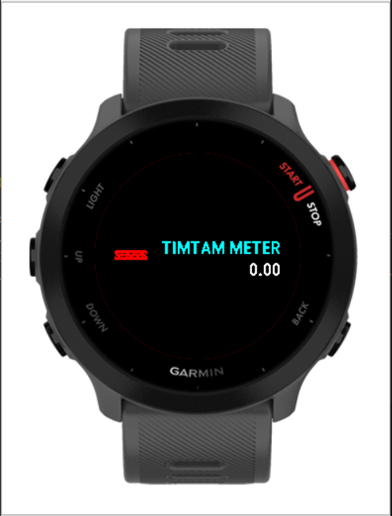
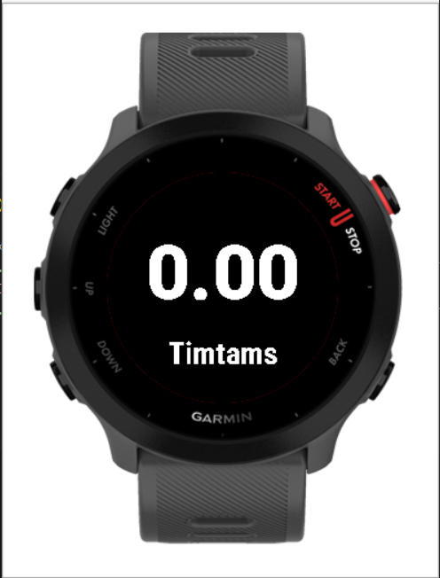

# Garmin Connect IQ Apps and Widgets
_Note: Currently just for FR55_
## Widgets

### 1. TimTam Meter
Shows you your current total calorie count in timtams(approx.).

 

### 2. Digital Compass (To Do)

### 3. P.O.I Marker (To Do)
Save points-of-interest by storing the current GPS coordinates and marking them with some category.

### 4. Course Map (To Do)
- For FR55
